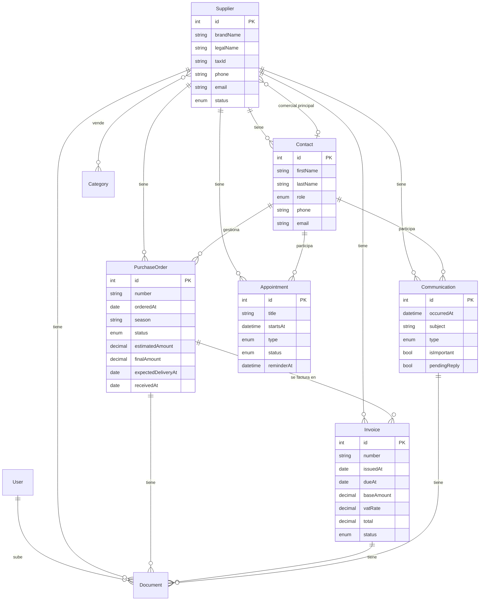
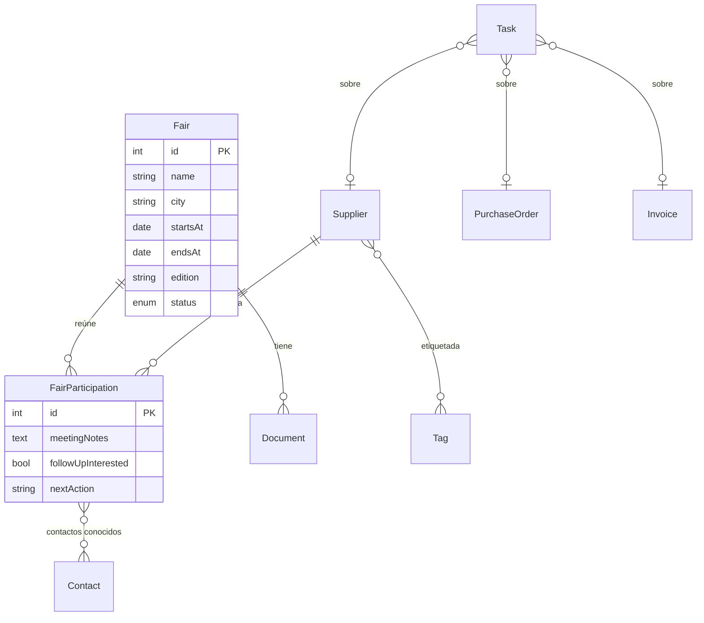

# Blueprint — CRM interno "Anuska Complementos"

> Documento de diseño. **No hay código todavía.** Requiere tu aprobación antes de implementar.
> Versión 1 · 2026-09-07

---

## 1. Análisis funcional

### 1.1 Contexto

Tienda de ropa multimarca, pequeña, gestionada por dos personas **no técnicas**. Hoy la
información vive dispersa: emails, Word/PDF en carpetas, WhatsApp, calendario de Google, notas
sueltas. El coste real no es "no tener un ERP", es **perder el hilo**: no saber cuándo llega un
pedido, qué factura está sin pagar, qué comercial hay que llamar, qué se habló en la última feria.

### 1.2 Idea central del sistema

El CRM gira alrededor de **una entidad raíz: el Proveedor (marca)**. Todo lo demás —pedidos,
facturas, comunicaciones, citas, documentos, contactos— **cuelga de un proveedor**. La pantalla
más importante del producto es la **ficha del proveedor**, que actúa como expediente completo.

No es un ERP. No hay gestión de stock, ni líneas de pedido con cantidades, ni contabilidad. Un
"pedido" aquí es **un registro con un estado y unas fechas**, no un albarán.

### 1.3 Perfil de usuario y consecuencias de diseño

| Necesidad del usuario | Consecuencia en el producto |
|---|---|
| No son técnicos | Cero jerga. Botones que dicen lo que hacen. Sin configuración obligatoria. |
| Pocas manos, mucho volumen de contexto | Todo a 1-2 clics desde la ficha del proveedor y desde el dashboard. |
| Trabajan con prisa (entra una llamada) | "Nueva comunicación" y "Nueva cita" accesibles desde cualquier pantalla del proveedor. |
| Móvil/tablet en la tienda | Responsive real, no "se ve pero no se usa". |
| Miedo a romper algo | Nada se borra de verdad (desactivar, anular, cancelar). Confirmaciones en acciones destructivas. |

### 1.4 Requisitos ambiguos detectados (decisiones propuestas)

Estos puntos del encargo admiten varias lecturas. Propongo una resolución para cada uno; **marca
en tu respuesta si alguna no te encaja.**

| # | Ambigüedad | Decisión propuesta para el MVP |
|---|---|---|
| A1 | "Productos o líneas de productos asociadas a pedidos" (sec. 1) vs. "no quiero gestión de stock" (sec. 7) | **Resuelto por el cliente:** el pedido es **solo informativo** (proveedor, fechas, estado, importe). El detalle de lo comprado **no se teclea**: vive en el PDF de la factura adjunta. Sin entidad `Product` y **sin campo de líneas**. `content` queda como texto libre **opcional** para una nota rápida ("Colección PV27"), no obligatorio. Desglose real → nunca, salvo que se pida. |
| A2 | "Comercial" ¿es una entidad propia? | **No.** Un comercial es un `Contact` con `role = SALES_REP`. El proveedor tiene un `primaryContact` (el comercial principal). Una sola tabla de personas: `Contact`. |
| A3 | "Temporada" y "Campaña" en pedidos | Campos de **texto corto** (`season`, `campaign`). Nada de entidades. Se puede convertir en catálogo con desplegable en Fase 2 si piden autocompletado. |
| A4 | "Recordatorios y próximas acciones" / "sistema de tareas" | MVP: **sin entidad `Task`**. El recordatorio es un campo `reminderAt` en la cita + el flag `pendingReply` en la comunicación, y el dashboard los saca por consulta. Entidad `Task/Reminder` genérica → **Fase 2** (ya está así en tu plan de fases). |
| A5 | Factura "Vencida" ¿es un estado que se guarda? | El estado guardado es `PENDING / PAID / CANCELLED`. **"Vencida" se deriva** (`dueAt < hoy && status = PENDING`) y se muestra como badge rojo. Sin cron que cambie estados en el MVP. |
| A6 | "Categorías/productos que vende" el proveedor | **Fase 2** (decidido por el cliente). El modelo deja el hueco preparado (`Category` N:M con `Supplier`), pero **no se implementa en el MVP**. |
| A7 | Documentos adjuntos a "muchas cosas" | Una entidad `Document` con **claves foráneas anulables** a cada propietario (`supplier_id`, `purchase_order_id`, `invoice_id`, `communication_id`). Nada de tipos polimórficos genéricos. |
| A8 | "Comprador" del pedido / "comercial del pedido" | El pedido referencia opcionalmente un `Contact` del proveedor (quién lo tramitó por parte de la marca). El usuario del CRM que lo creó ya queda en la auditoría (`createdBy`). |
| A9 | Ferias en el MVP | Tu sección 24 pone Ferias en **Fase 2**. El blueprint respeta eso: el modelo de datos deja el hueco preparado, pero **no se implementa en Fase 1**. |

---

## 2. Requisitos funcionales (MVP — Fase 1)

**RF-01 Autenticación.** Login con email + contraseña. Sin registro público. Cierre de sesión.
"Recordarme". Bloqueo por rol para la administración de usuarios.

**RF-02 Usuarios (solo ADMIN).** Crear usuario, editar, activar/desactivar, asignar rol
(`ROLE_ADMIN` / `ROLE_USER`), resetear contraseña. Primer admin creado por comando de consola.

**RF-03 Proveedores — listado.** Tabla con: nombre de marca, estado, comercial principal, fecha
del último pedido, fecha de la última factura, próxima cita. Buscar por texto. Filtrar por estado.
Ordenar por cualquier columna. Paginación. *(Filtro por categoría → Fase 2.)*

**RF-04 Proveedores — alta/edición.** Formulario con todos los campos de la sección 4. Validación.
Desactivar (no borrar). Reactivar.

**RF-05 Ficha de proveedor.** Cabecera + tarjetas de resumen + pestañas (Resumen, Pedidos,
Facturas, Comunicaciones, Citas, Documentos). Ver sección 11 de este blueprint.

**RF-06 Contactos.** Alta/edición/baja de contactos dentro de un proveedor. Marcar uno como
comercial principal. Tipos: comercial, administración, atención al cliente, dirección, otro.

**RF-07 Pedidos.** CRUD. Campos de la sección 7 del encargo. Estados (enum). Listado global de
pedidos con filtros (proveedor, estado, temporada, rango de fechas). Adjuntar documento.

**RF-08 Facturas.** CRUD. Cálculo de total a partir de base + IVA (o entrada manual de total con
aviso si no cuadra). Estados. Derivación de "vencida". Listado global con búsqueda por proveedor,
número, fecha, estado, importe. Ver/descargar el PDF. Asociar a un pedido.

**RF-09 Comunicaciones.** CRUD de registros manuales. Tipo (email/teléfono/WhatsApp/reunión/otro).
Flags "importante" y "pendiente de respuesta". Adjuntos. Listado global y por proveedor, ordenado
por fecha descendente (timeline).

**RF-10 Citas.** CRUD. Tipo, estado, ubicación, duración, `reminderAt`. Vista de listado y vista
de calendario mensual sencilla. Marcar como realizada / cancelada.

**RF-11 Documentos.** Subida de archivos (PDF, JPG, PNG, DOC/DOCX, XLS/XLSX). Se guarda el archivo
en disco y solo la referencia + metadatos en BD. Descarga con control de acceso. Listado por
proveedor (pestaña) y adjuntos en pedido/factura/comunicación.

**RF-12 Buscador global.** Una caja en la barra superior. Busca en proveedores, contactos,
pedidos, facturas, comunicaciones y citas. Resultados agrupados por tipo, con enlace directo.

**RF-13 Dashboard.** Bloques: *Hoy* (citas de hoy, recordatorios, comunicaciones pendientes de
respuesta), *Próximos días* (próximas citas, próximas entregas de pedidos, facturas por vencer),
*Resumen* (contadores), *Actividad reciente* (últimos pedidos/facturas/comunicaciones/citas).

**RF-14 Auditoría ligera.** Cada registro guarda `createdBy`, `createdAt`, `updatedBy`,
`updatedAt`. Visible en la ficha ("Creado por Ana el 3/2/2027 · Última modificación …").

**RF-15 Datos de demo.** Fixtures con ~10 proveedores y todo lo que cuelga de ellos.

---

## 3. Requisitos no funcionales

| Categoría | Requisito |
|---|---|
| **Simplicidad** | Un desarrollador junior/intermedio debe entender el proyecto en una tarde. Sin capas innecesarias. |
| **Rendimiento** | Volumen esperado: cientos de proveedores, miles de registros en total. Todo debe responder < 300 ms con índices normales. Nada de motores de búsqueda externos. |
| **Seguridad** | HTTPS en producción. Contraseñas con el hasher por defecto de Symfony (bcrypt/argon2id). CSRF en todos los formularios. Control de acceso a documentos (no URLs adivinables sin auth). Cabeceras de seguridad. Sin datos personales en query strings. |
| **RGPD** | Los contactos son datos personales de terceros. Base legal: interés legítimo (relación comercial). Permitir editar/borrar contacto. Documentar en `docs/rgpd.md`. |
| **Accesibilidad** | Contraste AA, navegación por teclado, `label` en todos los campos, foco visible, textos alternativos. |
| **Responsive** | Móvil ≥ 360 px, tablet, escritorio. Tablas con scroll horizontal o vista de tarjetas en móvil. |
| **i18n** | Interfaz en **español**. Textos vía `translations/messages.es.yaml` desde el día 1 (no hardcodeados en Twig) para no reescribir después. Sin multi-idioma real en el MVP. |
| **Zona horaria** | `Europe/Madrid`. Fechas guardadas en UTC por Doctrine, mostradas en local. |
| **Mantenibilidad** | PHPStan nivel 8, PHP-CS-Fixer, PHPUnit. Migraciones versionadas. Sin lógica de negocio en Twig. |
| **Portabilidad** | Arranca en local con un comando. Desplegable en un VPS con PHP-FPM + Nginx + MySQL sin reescribir nada. |
| **Copias de seguridad** | La carpeta de `var/uploads` (o `storage/`) y la BD deben poder respaldarse juntas. Documentado. |

---

## 4. Entidades (MVP)

Convención: todas las entidades usan los traits `TimestampableTrait` (`createdAt`, `updatedAt`) y
`BlameableTrait` (`createdBy`, `updatedBy`), rellenados por un listener de Doctrine.

> ⚠️ **Decisión de nombres.** La entidad de pedido se llama **`PurchaseOrder`** y su tabla
> **`purchase_order`**, porque `order` es palabra reservada de SQL y da problemas. En la interfaz
> el usuario ve siempre "Pedido".

### 4.1 `User`
| Campo | Tipo | Notas |
|---|---|---|
| id | int | PK |
| email | string(180) | único, login |
| roles | json | `["ROLE_USER"]` / `["ROLE_ADMIN"]` |
| password | string | hash |
| fullName | string(120) | |
| isActive | bool | desactivar sin borrar |
| createdAt / updatedAt | datetime | |

### 4.2 `Supplier`
| Campo | Tipo | Notas |
|---|---|---|
| id | int | PK |
| brandName | string(120) | nombre comercial de la marca |
| legalName | string(160) nullable | razón social |
| taxId | string(20) nullable | CIF/NIF |
| addressLine | string(180) nullable | |
| postalCode | string(10) nullable | |
| city | string(80) nullable | |
| province | string(80) nullable | |
| country | string(2) nullable | ISO, por defecto `ES` |
| phone | string(30) nullable | |
| email | string(180) nullable | email general |
| website | string(180) nullable | |
| notes | text nullable | |
| status | enum `SupplierStatus` | `ACTIVE` / `INACTIVE` |
| primaryContact | FK → Contact nullable | comercial principal |
| createdBy/updatedBy/createdAt/updatedAt | | auditoría |

> `categories` (N:M → `Category`) se añade en **Fase 2**; no está en el MVP.

Relaciones: `OneToMany` a `Contact`, `PurchaseOrder`, `Invoice`, `Communication`,
`Appointment`, `Document`.

### 4.3 `Contact`
| Campo | Tipo | Notas |
|---|---|---|
| id | int | PK |
| supplier | FK → Supplier | obligatorio |
| firstName | string(80) | |
| lastName | string(120) nullable | |
| role | enum `ContactRole` | `SALES_REP` / `ADMIN` / `CUSTOMER_SERVICE` / `MANAGEMENT` / `OTHER` |
| jobTitle | string(120) nullable | cargo libre |
| phone | string(30) nullable | |
| email | string(180) nullable | |
| notes | text nullable | |
| isActive | bool | |

### 4.4 `PurchaseOrder`  *(UI: "Pedido")*
| Campo | Tipo | Notas |
|---|---|---|
| id | int | PK |
| supplier | FK → Supplier | obligatorio |
| number | string(50) | número de pedido (puede repetirse entre proveedores; único por proveedor) |
| orderedAt | date | fecha del pedido |
| season | string(40) nullable | ej. "PV27" |
| campaign | string(80) nullable | ej. "Reposición septiembre" |
| contact | FK → Contact nullable | comercial que lo gestionó |
| content | text nullable | qué se pidió (texto libre — ver A1) |
| status | enum `OrderStatus` | ver sección 7 |
| estimatedAmount | decimal(12,2) nullable | importe estimado |
| finalAmount | decimal(12,2) nullable | importe final |
| expectedDeliveryAt | date nullable | entrega prevista |
| receivedAt | date nullable | recepción real |
| notes | text nullable | |
| documents | OneToMany → Document | |

### 4.5 `Invoice`  *(UI: "Factura")*
| Campo | Tipo | Notas |
|---|---|---|
| id | int | PK |
| supplier | FK → Supplier | obligatorio |
| purchaseOrder | FK → PurchaseOrder nullable | pedido relacionado |
| number | string(50) | número de factura |
| issuedAt | date | fecha de emisión |
| dueAt | date nullable | vencimiento |
| baseAmount | decimal(12,2) | base imponible |
| vatRate | decimal(5,2) | % IVA (ej. 21.00) |
| vatAmount | decimal(12,2) | cuota de IVA |
| total | decimal(12,2) | total |
| status | enum `InvoiceStatus` | `PENDING` / `PAID` / `CANCELLED` (vencida = derivada) |
| paidAt | date nullable | fecha de pago |
| notes | text nullable | |
| documents | OneToMany → Document | normalmente el PDF de la factura |

Regla: al guardar, si el usuario rellena base + IVA se calcula `vatAmount` y `total`; si
introduce el total a mano y no cuadra con `base * (1 + vatRate/100)` ± 0,02 €, se muestra un
aviso no bloqueante.

### 4.6 `Communication`  *(UI: "Comunicación")*
| Campo | Tipo | Notas |
|---|---|---|
| id | int | PK |
| supplier | FK → Supplier | obligatorio |
| contact | FK → Contact nullable | persona de contacto |
| occurredAt | datetime | cuándo ocurrió |
| subject | string(180) | asunto |
| type | enum `CommunicationType` | `EMAIL` / `PHONE` / `WHATSAPP` / `MEETING` / `OTHER` |
| body | text nullable | resumen / contenido |
| isImportant | bool | |
| pendingReply | bool | pendiente de respuesta → aparece en el dashboard |
| documents | OneToMany → Document | adjuntos |

> **Preparado para email (sec. 25).** `Communication` tiene campos opcionales inertes en el MVP:
> `sourceType` (`MANUAL` por defecto, futuro `GMAIL`/`IMAP`), `externalId`, `fromAddress`. No se
> usan todavía; evitan una migración dolorosa cuando se conecte el correo.

### 4.7 `Appointment`  *(UI: "Cita")*
| Campo | Tipo | Notas |
|---|---|---|
| id | int | PK |
| title | string(160) | |
| supplier | FK → Supplier nullable | normalmente obligatorio; nullable para llamadas internas |
| contact | FK → Contact nullable | |
| startsAt | datetime | fecha y hora |
| durationMinutes | smallint nullable | |
| type | enum `AppointmentType` | `SALES_VISIT` / `COLLECTION_PREVIEW` / `ORDER_MEETING` / `CALL` / `VIDEO_CALL` / `STORE_VISIT` / `OTHER` |
| location | string(180) nullable | |
| notes | text nullable | |
| status | enum `AppointmentStatus` | `PENDING` / `DONE` / `CANCELLED` |
| reminderAt | datetime nullable | recordatorio interno (dashboard) |

### 4.8 `Document`
| Campo | Tipo | Notas |
|---|---|---|
| id | int | PK |
| originalName | string(255) | nombre subido por el usuario |
| storagePath | string(255) | ruta relativa dentro del almacén (no adivinable, con hash) |
| mimeType | string(100) | |
| sizeBytes | int | |
| title | string(180) nullable | etiqueta opcional |
| uploadedBy | FK → User | |
| createdAt | datetime | |
| supplier | FK → Supplier nullable | ┐ |
| purchaseOrder | FK → PurchaseOrder nullable | ├ exactamente uno de estos 4 va relleno |
| invoice | FK → Invoice nullable | │ |
| communication | FK → Communication nullable | ┘ |

Validación: se exige que **uno y solo uno** de los cuatro propietarios esté definido (constraint
`AtLeastOneOf` + comprobación en el servicio de subida). `fair_id` se añadirá en Fase 2.

---

## 5. Diagrama ER (Mermaid) — MVP



### 5.1 Ampliación Fase 2 (no se implementa ahora)



---

## 6. Relaciones Doctrine (resumen técnico)

| Origen | Relación | Destino | Cascade / detalles |
|---|---|---|---|
| `Supplier` | `OneToMany` (`mappedBy=supplier`) | `Contact` | `cascade: [persist]`, `orphanRemoval: false` |
| `Supplier` | `OneToMany` | `PurchaseOrder` | sin cascade remove (histórico) |
| `Supplier` | `OneToMany` | `Invoice` | sin cascade remove |
| `Supplier` | `OneToMany` | `Communication` | `cascade: [persist, remove]` (si se borra el proveedor, se limpian) |
| `Supplier` | `OneToMany` | `Appointment` | sin cascade remove |
| `Supplier` | `ManyToOne` | `Contact` (`primaryContact`) | `onDelete: SET NULL` |
| `Supplier` | `ManyToMany` | `Category` | tabla `supplier_category` |
| `PurchaseOrder` | `ManyToOne` | `Supplier` | `nullable: false` |
| `PurchaseOrder` | `ManyToOne` | `Contact` | `nullable: true`, `onDelete: SET NULL` |
| `PurchaseOrder` | `OneToMany` | `Invoice` (`purchaseOrder`) | `onDelete: SET NULL` en Invoice |
| `Invoice` | `ManyToOne` | `Supplier` | `nullable: false` |
| `Invoice` | `ManyToOne` | `PurchaseOrder` | `nullable: true` |
| `Communication` | `ManyToOne` | `Supplier` / `Contact` | supplier obligatorio, contact opcional |
| `Appointment` | `ManyToOne` | `Supplier` / `Contact` | ambos opcionales a nivel de esquema |
| `Document` | `ManyToOne` | `Supplier` / `PurchaseOrder` / `Invoice` / `Communication` | los 4 nullable; `onDelete: CASCADE` en cada uno |
| `Document` | `ManyToOne` | `User` (`uploadedBy`) | `onDelete: SET NULL` |

Índices explícitos: `supplier.brandName`, `supplier.status`, `purchase_order.status`,
`purchase_order.expectedDeliveryAt`, `invoice.status`, `invoice.dueAt`, `appointment.startsAt`,
`communication.occurredAt`, `communication.pendingReply`. Índice `FULLTEXT` opcional pospuesto
(ver riesgos).

---

## 7. Estados y enums (PHP 8 `enum` con `->label()` en español)

```
SupplierStatus:      ACTIVE ("Activo") · INACTIVE ("Inactivo")

ContactRole:         SALES_REP ("Comercial") · ADMIN ("Administración") ·
                     CUSTOMER_SERVICE ("Atención al cliente") ·
                     MANAGEMENT ("Dirección") · OTHER ("Otro")

OrderStatus:         DRAFT ("Borrador") · PLACED ("Realizado") · CONFIRMED ("Confirmado") ·
                     PARTIALLY_RECEIVED ("Parcialmente recibido") · RECEIVED ("Recibido") ·
                     CANCELLED ("Cancelado")

InvoiceStatus:       PENDING ("Pendiente") · PAID ("Pagada") · CANCELLED ("Anulada")
                     [ "Vencida" es un estado visual derivado, no almacenado ]

CommunicationType:   EMAIL ("Email") · PHONE ("Teléfono") · WHATSAPP ("WhatsApp") ·
                     MEETING ("Reunión") · OTHER ("Otro")

AppointmentType:     SALES_VISIT ("Visita del comercial") ·
                     COLLECTION_PREVIEW ("Presentación de colección") ·
                     ORDER_MEETING ("Reunión de pedido") · CALL ("Llamada") ·
                     VIDEO_CALL ("Videollamada") · STORE_VISIT ("Visita a tienda") · OTHER ("Otro")

AppointmentStatus:   PENDING ("Pendiente") · DONE ("Realizada") · CANCELLED ("Cancelada")

--- Fase 2 ---
FairStatus:          PLANNED · CONFIRMED · DONE · CANCELLED
```

Cada enum implementa un método `label(): string` y un `color(): string` (para los badges). Un
Twig filter `|enum_label` y un componente `<twig:StatusBadge>` los pintan de forma uniforme.

---

## 8. Arquitectura Symfony

**Stack.** PHP 8.3+ · Symfony 7.3+ (o 8.0 si ya es estable en el momento de arrancar; se fija a la
versión estable que devuelva `composer create-project symfony/skeleton`) · Doctrine ORM 3 ·
MySQL 8 / MariaDB 11 · Twig · **AssetMapper** (sin Node/Webpack) · Stimulus · **Symfony UX Turbo**
(navegación fluida sin SPA) · Symfony UX Twig Components.

**Patrón general:** MVC clásico de Symfony, sin CQRS, sin arquitectura hexagonal, sin bus de
comandos. Es un CRUD con reglas de negocio pequeñas.

| Capa | Responsabilidad | Regla |
|---|---|---|
| **Controller** | Recibir request, invocar servicio/repositorio, devolver respuesta. | Máx. ~15 líneas por acción. Sin lógica de negocio. Sin queries complejas inline. |
| **Form Type** | Definir y validar formularios sobre entidades. | Uno por entidad + variantes (`SupplierType`, `QuickCommunicationType`). |
| **Repository** | Todas las consultas. | Métodos con nombre de negocio (`findActiveWithLastActivity()`), no query builders en el controller. |
| **Service** | Lógica que no es "guardar un formulario". | Ver lista abajo. |
| **Enum** | Estados y tipos + labels/colores. | Backed enums. |
| **Twig Component** | UI reutilizable. | Sin acceso a BD salvo componentes "live" (no hay en el MVP). |
| **EventListener** | Timestampable/Blameable, y poco más. | |
| **Voter** | **No en el MVP.** Con 2 roles y acceso total para `ROLE_USER`, basta `#[IsGranted('ROLE_USER')]` a nivel de controlador y `ROLE_ADMIN` en la zona de usuarios. Se añadirán Voters cuando haya permisos por registro. |
| **DTO** | Solo donde aporta: resultado del buscador global (`SearchResult`), payload del dashboard (`DashboardData`). CRUD trabaja directo sobre entidades. |
| **Messenger** | **No en el MVP.** Se añade cuando haya envío de emails o sincronización. |

**Servicios previstos (todos pequeños):**

- `DocumentStorage` — mueve el archivo subido a `storage/{yyyy}/{mm}/{hash}.{ext}`, valida
  mime/tamaño, genera la ruta, borra en disco cuando se elimina el `Document`.
- `DocumentDownloader` / controlador de descarga — comprueba permisos y devuelve
  `BinaryFileResponse`.
- `GlobalSearch` — ejecuta las búsquedas `LIKE` por entidad y agrupa en `SearchResult[]`.
- `DashboardData` (service + DTO) — reúne todas las consultas del dashboard en una llamada.
- `SupplierSummary` — calcula las tarjetas de la ficha (nº pedidos, total facturado, último
  pedido, última factura, próxima cita, último contacto).
- `InvoiceCalculator` — base + IVA → cuota + total, y comprobación de descuadre.
- `AppointmentReminders` — consulta citas con `reminderAt` en ventana; en el MVP solo alimenta el
  dashboard (sin push ni email).

**Auditoría:** trait `TimestampableTrait` + `BlameableTrait` y un único
`Doctrine\ORM\Event` listener (`onFlush` / `prePersist` / `preUpdate`) que rellena los 4 campos
usando `Security::getUser()`. ~50 líneas. Sin dependencias externas (no `gedmo/doctrine-extensions`).

---

## 9. Estructura de carpetas

```
anuska-crm/
├── compose.yaml                 # MySQL (+ Adminer opcional) para desarrollo
├── .env / .env.local
├── phpstan.dist.neon            # nivel 8
├── .php-cs-fixer.dist.php
├── phpunit.dist.xml
├── Makefile                     # atajos: make up / make db / make fixtures / make check
├── bin/console
├── config/
│   ├── packages/                # doctrine, security, twig, framework, ux...
│   └── routes.yaml
├── migrations/
├── public/
│   └── index.php
├── assets/
│   ├── app.js                   # entrypoint AssetMapper
│   ├── controllers/             # Stimulus: confirm, dropdown, file-preview, calendar, search
│   └── styles/
│       ├── app.scss
│       ├── _tokens.scss         # incluye la marca: --brand: #3d1f00
│       └── components/
├── src/
│   ├── Controller/
│   │   ├── DashboardController.php
│   │   ├── SupplierController.php
│   │   ├── ContactController.php
│   │   ├── PurchaseOrderController.php
│   │   ├── InvoiceController.php
│   │   ├── CommunicationController.php
│   │   ├── AppointmentController.php
│   │   ├── DocumentController.php      # subir / descargar / borrar
│   │   ├── SearchController.php
│   │   ├── SecurityController.php
│   │   └── Admin/UserController.php
│   ├── Entity/
│   ├── Enum/
│   ├── Form/
│   ├── Repository/
│   ├── Service/
│   ├── Dto/
│   ├── EventListener/
│   │   └── AuditableListener.php
│   ├── Twig/
│   │   ├── Components/                 # StatusBadge, StatCard, PageHeader...
│   │   └── AppExtension.php            # filtros: enum_label, money, ago
│   ├── DataFixtures/
│   └── Security/                       # (Voters solo si se necesitan más adelante)
├── templates/
│   ├── base.html.twig
│   ├── _partials/                      # navbar, sidebar, flash, pagination
│   ├── components/
│   ├── dashboard/
│   ├── supplier/                       # index, new, edit, show + _tab_*.html.twig
│   ├── purchase_order/
│   ├── invoice/
│   ├── communication/
│   ├── appointment/
│   ├── search/
│   ├── security/
│   └── admin/user/
├── translations/
│   └── messages.es.yaml
├── storage/                            # archivos subidos (fuera de public/, en .gitignore)
├── tests/
│   ├── Functional/                     # smoke de cada controlador + flujos críticos
│   └── Unit/                           # InvoiceCalculator, GlobalSearch, DocumentStorage
└── docs/
    ├── blueprint.md                    # este documento
    ├── deploy.md
    └── rgpd.md
```

---

## 10. Rutas principales

| Método | Ruta | Nombre | Acción |
|---|---|---|---|
| GET | `/` | `dashboard` | Dashboard |
| GET/POST | `/login` · `/logout` | `app_login` · `app_logout` | Auth |
| GET | `/proveedores` | `supplier_index` | Listado (query params: `q`, `status`, `category`, `sort`, `page`) |
| GET/POST | `/proveedores/nuevo` | `supplier_new` | Alta |
| GET | `/proveedores/{id}` | `supplier_show` | Ficha (pestaña por defecto: Resumen) |
| GET | `/proveedores/{id}/{tab}` | `supplier_tab` | Pestañas: `pedidos`,`facturas`,`comunicaciones`,`citas`,`documentos` (Turbo Frame) |
| GET/POST | `/proveedores/{id}/editar` | `supplier_edit` | Edición |
| POST | `/proveedores/{id}/estado` | `supplier_toggle_status` | Activar/desactivar |
| GET/POST | `/proveedores/{id}/contactos/nuevo` | `contact_new` | Alta contacto |
| GET/POST | `/contactos/{id}/editar` | `contact_edit` | |
| GET | `/pedidos` | `purchase_order_index` | Listado global + filtros |
| GET/POST | `/proveedores/{id}/pedidos/nuevo` | `purchase_order_new` | Alta (proveedor precargado) |
| GET/POST | `/pedidos/{id}` · `/pedidos/{id}/editar` | `purchase_order_show` · `_edit` | |
| GET | `/facturas` | `invoice_index` | Listado global + búsqueda |
| GET/POST | `/proveedores/{id}/facturas/nueva` | `invoice_new` | |
| GET/POST | `/facturas/{id}` · `/facturas/{id}/editar` | `invoice_show` · `_edit` | |
| GET | `/comunicaciones` | `communication_index` | Listado global (timeline) |
| GET/POST | `/proveedores/{id}/comunicaciones/nueva` | `communication_new` | Alta rápida |
| GET/POST | `/comunicaciones/{id}/editar` | `communication_edit` | |
| GET | `/citas` | `appointment_index` | Lista + `?view=calendar` |
| GET/POST | `/citas/nueva` · `/citas/{id}/editar` | `appointment_new` · `_edit` | |
| POST | `/citas/{id}/estado` | `appointment_set_status` | Realizada/Cancelada |
| POST | `/documentos/subir` | `document_upload` | Multipart; recibe el tipo y el id del propietario |
| GET | `/documentos/{id}` | `document_download` | Descarga con control de acceso |
| POST | `/documentos/{id}/borrar` | `document_delete` | |
| GET | `/buscar?q=` | `search` | Buscador global (HTML + fragmento Turbo) |
| GET | `/admin/usuarios` … | `admin_user_*` | CRUD usuarios (solo `ROLE_ADMIN`) |
| GET | `/configuracion` | `settings_index` | Datos de la empresa (solo `ROLE_ADMIN`). Categorías → Fase 2. |

---

## 11. Pantallas

### 11.1 Login
Centrada, logo, email + contraseña + "recordarme". Nada más.

### 11.2 Dashboard
- **Barra superior:** logo, buscador global (siempre visible), usuario.
- **Hoy:** lista de citas de hoy (hora + proveedor + tipo), recordatorios activos,
  comunicaciones con `pendingReply = true`.
- **Próximos días (7):** próximas citas, pedidos con `expectedDeliveryAt` en rango,
  facturas `PENDING` con `dueAt` en rango o ya vencidas.
- **Resumen (tarjetas):** proveedores activos · pedidos abiertos (no `RECEIVED`/`CANCELLED`) ·
  facturas pendientes · importe pendiente de pago · citas próximas.
- **Actividad reciente:** 5 últimos de pedidos / facturas / comunicaciones / citas.

### 11.3 Proveedores — listado
Tabla: **Marca · Estado · Comercial principal · Último pedido · Última factura · Próxima cita ·
Acciones (ver / editar / activar-desactivar)**. Encima: buscador + filtro por estado +
botón **"Nuevo proveedor"**. En móvil, cada fila es una tarjeta.

### 11.4 Ficha del proveedor  *(pantalla clave)*
- **Cabecera:** nombre de marca, badge de estado, comercial principal (nombre + tel + email con
  botones "llamar"/"email"), web. Botones: **Editar**, **Nueva comunicación**, **Nueva cita**,
  **Nuevo pedido**, **Nueva factura**.
- **Tira de tarjetas:** Total de pedidos · Total facturado · Último pedido · Última factura ·
  Próxima cita · Último contacto.
- **Pestañas (Turbo Frames, la URL cambia):**
  1. **Resumen** — datos fiscales y de contacto + notas + contactos (mini-lista) + timeline
     combinado corto (últimas 10 actividades de todo tipo) + bloque de auditoría.
  2. **Pedidos** — tabla de pedidos del proveedor + "Nuevo pedido".
  3. **Facturas** — tabla + totales (pagado / pendiente / vencido) + "Nueva factura".
  4. **Comunicaciones** — timeline vertical con icono por tipo, badges "importante" /
     "pendiente", + "Nueva comunicación".
  5. **Citas** — próximas y pasadas + "Nueva cita".
  6. **Documentos** — cuadrícula/lista con icono por tipo, tamaño, fecha, quién subió +
     "Subir documento".

### 11.5 Formularios de alta/edición
Proveedor, contacto, pedido, factura, comunicación, cita. Una columna, campos agrupados en
secciones cortas con subtítulo, ayudas contextuales, botones **Guardar** / **Cancelar** fijos
abajo. El formulario de comunicación y el de cita tienen versión "rápida" (menos campos) cuando
se abren desde la ficha del proveedor.

### 11.6 Listados globales
Pedidos, Facturas, Comunicaciones, Citas: misma plantilla de tabla con filtros propios. Citas
además con **vista de calendario mensual** (Stimulus + una librería mínima o una tabla propia;
ver riesgos).

### 11.7 Buscador global
Al escribir ≥ 2 caracteres, panel desplegable con resultados agrupados: **Proveedores ·
Contactos · Pedidos · Facturas · Comunicaciones · Citas**, máx. 5 por grupo, "ver todos".
Página `/buscar?q=` con resultados completos.

### 11.8 Administración (solo ADMIN)
- **Usuarios:** tabla + alta/edición + reset de contraseña + activar/desactivar.
- **Configuración:** datos de la tienda (para futuros PDF/emails). Mínimo.
  *(Gestión de categorías de producto → Fase 2.)*

---

## 12. Componentes reutilizables

**Twig Components:**
`<twig:PageHeader title breadcrumbs actions>` · `<twig:StatCard label value icon trend?>` ·
`<twig:StatusBadge enum>` · `<twig:DataTable columns rows sort>` (o macro) ·
`<twig:EmptyState icon title text action>` · `<twig:Timeline items>` ·
`<twig:FileList documents>` · `<twig:FileUpload ownerType ownerId>` ·
`<twig:ContactCard contact>` · `<twig:ConfirmButton>` (Stimulus) ·
`<twig:FlashMessages>` · `<twig:Pagination>`.

**Stimulus controllers:** `confirm` (diálogo antes de acciones destructivas), `dropdown`,
`file-preview` (nombre + tamaño antes de subir), `search` (debounce + panel), `calendar`
(navegación de mes), `autosubmit` (filtros que se aplican al cambiar), `phone-link`.

**Twig filters/functions (`AppExtension`):** `|money` (formato `1.234,56 €`), `|enum_label`,
`|ago` ("hace 3 días"), `|doc_icon`.

**SCSS:** un sistema de tokens (`_tokens.scss`) + utilidades mínimas + componentes. Sin framework
CSS pesado. Paleta anclada a la marca (ver sección 17).

---

## 13. Flujos de usuario

**Flujo 1 — Nuevo proveedor.**
`Proveedores → Nuevo proveedor` → guardar → redirige a la ficha → botón **"Añadir contacto"**
(marcar como comercial principal) → pestaña **Documentos → Subir**. 3 pantallas, sin callejones.

**Flujo 2 — Nuevo pedido.**
Desde la ficha del proveedor → **Nuevo pedido** (proveedor precargado) → temporada, importe
estimado, fecha, estado `PLACED`, entrega prevista → guardar → opción de adjuntar el documento
del pedido en la misma pantalla de confirmación.

**Flujo 3 — Llega una factura.**
Ficha del proveedor → **Nueva factura** → número, fecha, base + IVA (total automático) → subir
PDF → desplegable "Pedido relacionado" (pedidos del proveedor) → guardar. Estado inicial
`PENDING`.

**Flujo 4 — Llama un comercial.**
Desde cualquier sitio: botón **Nueva comunicación** en la ficha → tipo `PHONE`, contacto,
resumen → checkbox **"Crear cita de seguimiento"**: si se marca, al guardar abre el formulario
rápido de cita con proveedor y contacto precargados.

**Flujo 5 — Feria (Fase 2).**
`Ferias → Nueva feria` → añadir proveedores participantes → por cada uno, notas de reunión +
"interesa contactar" + próxima acción → esas próximas acciones aparecen como tareas/recordatorios.

**Flujo 6 — Nueva cita.**
`Citas → Nueva cita` o desde la ficha → proveedor, contacto, fecha/hora, tipo, `reminderAt`
(desplegable: "sin recordatorio / 1 h antes / 1 día antes / 2 días antes") → guardar → aparece en
Dashboard y en la pestaña Citas del proveedor.

---

## 14. MVP (Fase 1) — alcance cerrado

**Incluye:** proyecto Symfony + calidad · BD + migraciones · autenticación + usuarios (admin) ·
layout + navegación + tokens de marca · dashboard · proveedores (CRUD + listado + ficha con
pestañas) · contactos · categorías · pedidos · facturas (con PDF) · comunicaciones · citas
(lista + calendario simple + recordatorio interno) · documentos (subida/descarga/borrado) ·
buscador global básico · fixtures de demo · auditoría ligera · i18n español · responsive ·
tests de los flujos críticos.

**No incluye (fuera de Fase 1):** ferias, tareas/recordatorios avanzados, tags, exportación
CSV/Excel, filtros avanzados guardados, cualquier integración externa.

---

## 15. Funcionalidades futuras

**Fase 2:** Ferias + `FairParticipation` · entidad `Task/Reminder` genérica con vencimiento y
"hecho" · `Tag` N:M · exportación CSV/Excel de los listados · filtros avanzados y vistas
guardadas · mejoras de dashboard (mini-gráfico de gasto por temporada) · notificaciones internas
de recordatorios (campana) · pagos parciales de factura (`Payment`).

**Fase 3 (investigación):** conexión Gmail/IMAP (entidad `EmailMessage`, asociación
email↔proveedor/pedido/factura, alta automática de `Communication`) · Google/Outlook Calendar
(sync bidireccional de `Appointment`) · emails y WhatsApp automáticos de recordatorio · OCR/IA de
facturas (subir PDF → propuesta de proveedor/número/fecha/base/IVA/total para confirmar) ·
importación masiva de facturas · auditoría de campo completa (`AuditLog`) · estadísticas.

**Ganchos ya preparados en el MVP para no sufrir después:**
- `Communication.sourceType/externalId/fromAddress` (inertes) → conexión de correo.
- `Document` con metadatos y almacenamiento por ruta → OCR lee el fichero por `storagePath`.
- Enums con `label()` → añadir estados sin tocar plantillas.
- `reminderAt` en citas → base para notificaciones/sync de calendario.
- Traits de auditoría → ampliables a historial completo sin migrar datos.

---

## 16. Riesgos técnicos

| # | Riesgo | Impacto | Mitigación |
|---|---|---|---|
| R1 | `order` es palabra reservada SQL | Errores raros de Doctrine/DQL | Entidad `PurchaseOrder`, tabla `purchase_order`. Decidido. |
| R2 | Documentos polimórficos (4 FKs anulables) | Integridad, consultas | Constraint "uno y solo uno"; `onDelete: CASCADE` por FK; helper `Document::owner()`. Revisar si crece a >6 propietarios (entonces sí, tabla de enlace por tipo). |
| R3 | "Factura vencida" derivada vs. almacenada | Informes incoherentes si se mezcla | Regla única en `InvoiceRepository` y en `StatusBadge`. Nunca guardar `OVERDUE`. Si en Fase 2 se quiere reporting histórico, un comando nocturno marca un flag, no el estado. |
| R4 | Redondeo de IVA (`decimal` ↔ string en PHP) | Descuadres de céntimos | `InvoiceCalculator` con `bcmath` o `brick/math`; comparaciones con tolerancia 0,02 €; nunca `float`. |
| R5 | Zona horaria / fechas | Citas y vencimientos "a un día" | `default_timezone` UTC en Doctrine, `Europe/Madrid` en la app; tests de frontera de día. |
| R6 | Almacenamiento de archivos y backups | Pérdida de documentos | Carpeta `storage/` fuera de `public/`, en `.gitignore`; `deploy.md` con backup conjunto BD+storage; validación estricta de mime/extensión/tamaño; nombres con hash (no traversal). |
| R7 | Búsqueda global con `LIKE '%...%'` | Lenta si el dataset crece mucho | Aceptable para el volumen previsto. Índices en las columnas buscadas. Plan B documentado: `FULLTEXT` MySQL; plan C: Meilisearch. No antes de necesitarlo. |
| R8 | Primer usuario / quedarse fuera | No poder entrar | Comando `bin/console app:user:create` (interactivo) + un admin en las fixtures de dev. |
| R9 | Turbo + errores de validación de formularios | Formularios que "no responden" | Devolver `422` con el form re-renderizado (patrón oficial Symfony UX Turbo); test funcional que lo cubre. |
| R10 | Vista de calendario | Sobre-ingeniería o dependencia pesada | MVP: tabla mensual propia en Twig + Stimulus para cambiar de mes (sin librería). FullCalendar solo si piden arrastrar/soltar (Fase 2). |
| R11 | Subida de ficheros grande / tipos peligrosos | Seguridad, disco | Límite 10 MB/fichero, lista blanca de extensiones y mime, `X-Content-Type-Options: nosniff`, servir siempre como adjunto salvo PDF/imagen. |
| R12 | RGPD (datos de contactos) | Cumplimiento | `docs/rgpd.md`, borrado real de contacto disponible, sin exportación pública. |
| R13 | AssetMapper con SCSS | SCSS necesita compilación | Usar `symfonycasts/sass-bundle` (compila sin Node) **o** CSS plano con custom properties. Decisión en sección 17. |
| R14 | Symfony 8 recién salida al arrancar | Bundles UX no compatibles aún | Fijar a la última **estable** con ecosistema UX compatible (7.3+); subir a 8 cuando el ecosistema acompañe. |

---

## 17. Decisiones de arquitectura (ADR resumido)

| ADR | Decisión | Motivo |
|---|---|---|
| ADR-01 | **Monolito Symfony con Twig + Turbo**, sin SPA | Requisito explícito; menos superficie, más mantenible por un junior. |
| ADR-02 | **Proveedor como agregado raíz**; el resto cuelga de él | Refleja el negocio; simplifica navegación y permisos. |
| ADR-03 | **Sin entidad `Product` en el MVP** (texto libre en el pedido) | El encargo descarta gestión de stock; evita catálogo prematuro. |
| ADR-04 | **`Contact` única** para comerciales y demás roles | Una tabla en vez de tres; `role` como enum. |
| ADR-05 | **Estados como `enum` PHP backed** con `label()`/`color()` | Tipado fuerte, sin tabla de catálogo, i18n centralizada. |
| ADR-06 | **"Vencida" derivada**, no almacenada | Evita cron y estados que se desincronizan. |
| ADR-07 | **Auditoría ligera con traits + un listener propio** | 4 campos; no justifica `gedmo/doctrine-extensions`. |
| ADR-08 | **Documentos: entidad con 4 FKs anulables**, archivo en disco | Integridad referencial + backups simples; nada en BLOB. |
| ADR-09 | **Sin Voters, sin Messenger, sin DTOs de CRUD en el MVP** | YAGNI; se añaden cuando aparezca el caso real. |
| ADR-10 | **AssetMapper (sin Node)** + `sass-bundle` para SCSS | Cero tooling JS; despliegue trivial en VPS. |
| ADR-11 | **Buscador con `LIKE` + índices**, servicio dedicado | Suficiente para el volumen; sin infra extra. |
| ADR-12 | **Docker solo para MySQL en local**; PHP con `symfony serve` | Lo justo para no instalar MySQL a mano; despliegue clásico PHP-FPM. |
| ADR-13 | **Textos vía `messages.es.yaml` desde el día 1** | No reescribir plantillas si algún día hay más idiomas. |
| ADR-14 | **Marca `#3d1f00` como color primario** | Coherencia con la etiqueta física de la tienda. |

### 17.1 Sistema visual (tokens)

Estética objetivo: **Linear / Notion / Stripe** — limpio, mucho blanco, tipografía legible,
tablas cómodas, color usado con moderación. Adaptado a moda: cálido, no corporativo-frío.

```scss
// _tokens.scss
:root {
  --brand:        #3d1f00;   // marrón etiqueta (acciones primarias, cabeceras)
  --brand-hover:  #52290a;
  --brand-100:    #f4ece3;   // fondos suaves / hover de fila
  --brand-50:     #faf6f0;   // fondo de sección

  --ink:          #1c1917;   // texto principal
  --ink-soft:     #57534e;   // texto secundario
  --line:         #e7e2db;   // bordes / separadores
  --surface:      #ffffff;
  --bg:           #fbfaf8;

  --ok:     #1a7f4b;  --ok-bg:   #e7f4ec;
  --warn:   #b45309;  --warn-bg: #fdf0e2;
  --danger: #b42318;  --danger-bg:#fdeceb;
  --info:   #1d4ed8;  --info-bg: #e8eefc;

  --radius: 10px;
  --shadow-sm: 0 1px 2px rgba(28,25,23,.06);
  --shadow-md: 0 4px 16px rgba(28,25,23,.10);
  --font: "Inter", system-ui, -apple-system, "Segoe UI", Roboto, sans-serif;
}
```

Badges de estado por color: `ACTIVE/PAID/RECEIVED/DONE` → `--ok`; `PENDING/DRAFT/PLACED` →
`--warn`; vencida/`CANCELLED` → `--danger`; `CONFIRMED/PARTIALLY_RECEIVED` → `--info`.

---

## 18. Plan de implementación por fases

Cada sub-fase termina con: código + tests en verde + PHPStan/CS limpios + lista de archivos +
instrucciones para probar + **pausa para tu revisión**.

### Fase 1 — MVP

| Sub-fase | Contenido | Entregable comprobable |
|---|---|---|
| **F1.0 Bootstrap** | `composer create-project`, git, `compose.yaml` (MySQL), `.env`, PHPStan 8, PHP-CS-Fixer, PHPUnit, `Makefile`, AssetMapper + Turbo + sass-bundle. | `make up` levanta la app en `https://localhost:8000` con una página vacía; `make check` pasa. |
| **F1.1 Auth + layout** | Entidad `User`, `security.yaml`, login/logout, comando crear-admin, `base.html.twig` con navbar + sidebar + buscador (maqueta), tokens SCSS, `messages.es.yaml`, `Admin\UserController`. | Login funciona; `ROLE_USER` no ve `/admin/usuarios`; navegación pintada con la marca. |
| **F1.2 Proveedores + Contactos** | Entidades, migraciones, repos, `SupplierType`/`ContactType`, listado con búsqueda/filtro por estado/orden/paginación, alta/edición, activar-desactivar, CRUD de contactos anidado, comercial principal. | Crear/editar proveedor y contactos; listado filtrable; test funcional de CRUD. |
| **F1.3 Ficha de proveedor** | `supplier_show` + pestañas con Turbo Frames, `SupplierSummary` service + tarjetas, timeline combinado, bloque de auditoría (`AuditableListener` + traits). | Ficha completa navegable; tarjetas con datos reales; auditoría rellenándose. |
| **F1.4 Pedidos** | Entidad `PurchaseOrder`, enum `OrderStatus`, listado global + filtros, alta desde ficha, edición, pestaña Pedidos. | CRUD de pedidos + cambio de estado; test de listado/filtros. |
| **F1.5 Facturas** | Entidad `Invoice`, `InvoiceCalculator` (bcmath), enum, "vencida" derivada, listado con búsqueda por todos los criterios, asociación a pedido. | CRUD de facturas; total calculado; badge "vencida"; test unitario del cálculo. |
| **F1.6 Comunicaciones** | Entidad, enum, flags importante/pendiente, formulario rápido desde ficha, timeline, listado global. | Registrar comunicación; flags visibles en dashboard/ficha. |
| **F1.7 Citas + recordatorios** | Entidad, enums, formulario (rápido y completo), lista + calendario mensual propio, `reminderAt`, `AppointmentReminders` → dashboard, cambio de estado. | Crear cita; aparece en calendario y dashboard "Hoy/Próximos". |
| **F1.8 Documentos** | `Document`, `DocumentStorage`, subida multipart, descarga con control de acceso, borrado (disco + BD), `<twig:FileUpload>` / `<twig:FileList>`, adjuntos en proveedor/pedido/factura/comunicación. | Subir/ver/descargar/borrar PDF e imagen; test de seguridad de ruta. |
| **F1.9 Buscador global** | `GlobalSearch` + `SearchResult` DTO, `SearchController`, panel Stimulus con debounce, página de resultados. | Buscar "Marca X" devuelve resultados agrupados con enlaces correctos. |
| **F1.10 Dashboard** | `DashboardData` service + DTO, plantilla con los 4 bloques, enlaces a todo. | Dashboard con datos reales de las fixtures. |
| **F1.11 Fixtures + pulido** | Fixtures realistas (10 proveedores, 1-3 contactos c/u, varios pedidos/facturas/comunicaciones/citas, estados variados), pase de accesibilidad y responsive, suite de tests de flujos críticos, `docs/deploy.md` y `docs/rgpd.md`. | `make fixtures` deja el CRM lleno y navegable; toda la suite en verde. |

### Fase 2 y Fase 3
Según secciones 15. **No se inicia hasta que la Fase 1 esté terminada y aprobada.**

---

## Decisiones cerradas con el cliente

- ✅ **A1 — Pedidos:** solo informativos (proveedor, fechas, estado, importe). El detalle de lo
  comprado va en el PDF de la factura. Sin líneas de producto.
- ✅ **A6 — Categorías:** a Fase 2. El MVP no las incluye.
- ✅ **Citas — calendario:** vista mensual sencilla, sin arrastrar/soltar.
- ✅ **Docker:** solo para MySQL en local; PHP con `symfony serve`.

## Pendientes menores (defaults asumidos si no dices lo contrario)

- **A5 — Facturas vencidas:** "Vencida" = indicador visual derivado, no estado guardado. *(asumo sí)*
- **SCSS:** compilado sin Node con `sass-bundle`. *(asumo sí)*
- **Symfony:** última estable con UX compatible (7.3.x), subir a 8 cuando acompañe. *(asumo sí)*
- **Branding:** app llamada "Anuska Complementos CRM" en la barra y el `<title>`. *(asumo sí)*

Estos cuatro tienen default sensato; **arranco con ellos salvo que me corrijas.**
